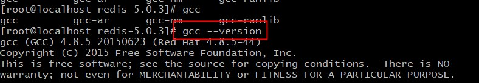
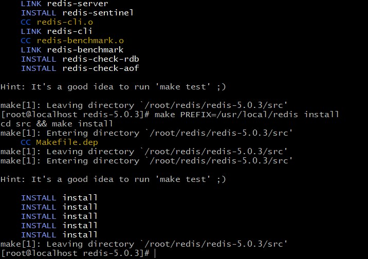
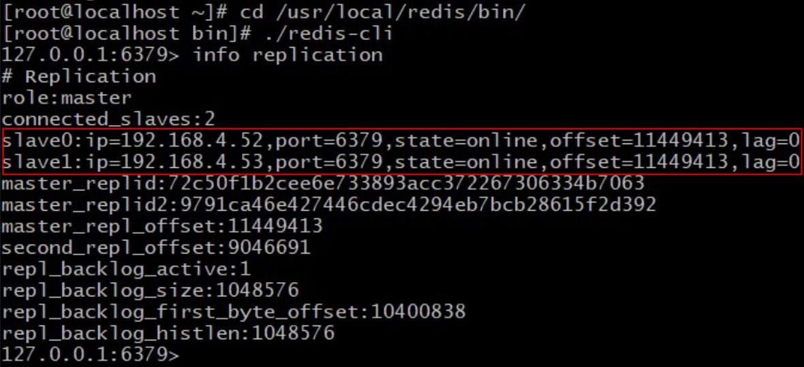

# CentOS7.9安装redis-5.0.3

# Redis介绍
    工作中使用的redis较多，主要用来做缓存，看项目规模一般采用单节点、哨兵模式、集群模式。

Redis哨兵模式和Redis集群模式是用于提高Redis可用性和扩展性的两种不同架构，它们各自具有一些优点和缺点：


# 哨兵模式

优点：
- 自动故障转移：哨兵模式可以自动检测主服务器故障并触发故障转移，从而保持服务的连续性。

- 简单配置：相对于Redis集群，Redis哨兵的配置和维护较为简单，适合一些低复杂性的高可用性需求。

- 适用于主从架构：哨兵模式是主从复制的增强版，适用于需要一主多从的场景。

缺点：
- 响应时间不确定：故障转移需要一定时间，响应时间不确定，可能对某些应用程序不适用。

- 有限的可扩展性：哨兵模式的可扩展性有限，不适合需要大规模扩展的应用程序。

- 配置复杂性：虽然相对较简单，但仍然需要配置和管理哨兵节点以确保其可用性。


# 集群模式

优点：
- 自动分片：Redis集群可以自动分片数据到多个节点，允许处理大量数据并提供更高的可扩展性。

- 高吞吐量：Redis集群可以在多个节点上并行处理请求，提供更高的读写吞吐量。

- 高可用性：Redis集群可以配置多个主节点，提供更高的可用性和容错性。

缺点：
- 复杂性：Redis集群的配置和管理比较复杂，包括分片、数据迁移、重新平衡等任务。

- 不适用于单点事务：Redis集群不支持事务跨分片，因此在需要事务的场景中可能不适用。

- 数据迁移开销：在数据迁移时，可能会引入一些性能开销，因此需要谨慎规划和管理。

**根据应用程序的具体需求，您可以选择使用Redis哨兵模式或Redis集群模式。哨兵模式更适合中小规模的应用，而集群模式适合需要大规模扩展和高吞吐量的应用。需要权衡可用性、性能和复杂性来做出最合适的选择**

## 设置主从结构有三种方式

  **参考文献** https://mp.weixin.qq.com/s/naRalMKGkddmH1_H1KChlw

- 1. 在redis.conf中配置replicaof <masterip> <masterport>，如replicaof 192.168.4.51 6379将建立与实例192.168.4.51:6379的主从关系；这种方式等同于在Redis启动命令中增加参数replicaof参数。

- 2. 在redis-server启动参数中增加“--replicaof”参数。
- 3. 使用redis-cli客户端连接到redis服务，执行replicaof <masterip> <masterport>命令。注意：如果Redis重启，主从关系将无法重新建立。


## 主机关闭持久化时复制的安全性

当master关闭了持久化时，如果发生故障后自动重启时，由于本地没有保存持久化的数据，重启的Redis内存数据为空，而slave会自动同步master的数据，就会导致slave的数据也会被清空。

所以，我们应该尽可能为master节点开启持久化，这样可以防止Redis故障重启时数据丢失，进而导致slave数据被清除。如果确实无法开启持久化机制，那应该配置master节点无法自动重启，确保从机可以成为新的master节点，防止数据被清除。


# 三节点哨兵模式redis安装

    使用三台虚拟机安装三节点哨兵模式redis。三台机器分别为host1(51)、host2(52)、host3(52)。

1. 解压编译

    将redis-5.0.3.tar.gz解压。
    先检查是否安装gcc，否则先安装gcc
    
2. 编译源码

```shell
make -j $(nproc)
make PREFIX=/usr/local/redis install
mkdir -pv /usr/local/redis/{etc,logs,run,data}
cp redis.conf /usr/local/redis/etc/
创建 redis 用户用于运行 redis
useradd -r -u 637 -s /sbin/nologin redis
更改 redis 相关目录权限
chown -R redis.redis /usr/local/redis/{logs,run,data}
```

 

修改 redis 配置文件

```shell
[root@localhost ~]# vim /usr/local/redis/etc/redis.conf
bind 0.0.0.0
port 6379
protected-mode no
pidfile /usr/local/redis/run/redis.pid
logfile "/usr/local/redis/logs/redis.log"
save ""
#save 900 1
#save 300 10
#save 60 10000
dir /usr/local/redis/data
appendonly no
```

**如果配置 redis 从节点，额外添加如下两条配置**

```shell
replicaof <master_ip> <master_port>
slave-read-only yes
```

在 `/etc/systemd/system/`  目录下创建 redis 的 systemd 启动文件 redis.service

```shell
[root@localhost ~]# vim /etc/systemd/system/redis.service
[Unit]
Description=Redis Data Structure Server
Documentation=https://redis.io/documentation
Wants=network-online.target
After=network-online.target

[Service]
Type=simple
ExecStart=/usr/local/redis/bin/redis-server \
  /usr/local/redis/etc/redis.conf \
  --supervised systemd \
  --daemonize no
LimitNOFILE=10032
NoNewPrivileges=yes
OOMScoreAdjust=-900
PrivateTmp=yes
TimeoutStartSec=infinity
TimeoutStopSec=infinity
UMask=0077
User=redis
Group=redis
WorkingDirectory=/usr/local/redis

[Install]
WantedBy=multi-user.target
```

启动 redis

```shell
[root@localhost ~]# systemctl daemon-reload
[root@localhost ~]# systemctl enable redis.service --now
```

复制  redis sentinel 配置文件（redis源码目录下的sentinel.conf）

```shell
[root@localhost ~]# cp redis-5.0.3/sentinel.conf /usr/local/redis/etc/sentinel.conf
[root@localhost ~]# chown -R redis.redis /usr/local/redis/etc/
```

修改 sentinel 配置文件

```shell
[root@localhost ~]# vi /usr/local/redis/etc/sentinel.conf
logfile "/usr/local/redis/logs/redis-sentinel.log"
pidfile /usr/local/redis/run/redis-sentinel.pid
sentinel monitor mymaster <master_ip> 6379 2
```
  这条配置项用于告知哨兵需要监听的主节点：
  - sentinel monitor：代表监控。
  - mymaster：代表主节点的名称，可以自定义。
  - <master_ip>：代表监控的主节点ip，6379代表端口。
  - 2：法定数量，代表只有两个或两个以上的哨兵认为主节点不可用的时候，才会把主节点设置为ODOWN状态，然后进行failover操作。

**参考文献** https://zhuanlan.zhihu.com/p/354720754

在 `/etc/systemd/system/`  目录下创建 redis-sentinel 的 systemd 启动文件 redis-sentinel.service

```shell
[root@localhost ~]# vi /etc/systemd/system/redis-sentinel.service
[Unit]
Description=Redis Sentinel Process Manager
After=syslog.target network.target

[Service]
Type=simple
User=redis
Group=redis
PIDFile=/usr/local/redis/run/redis-sentinel.pid
ExecStart=/usr/local/redis/bin/redis-sentinel \
  /usr/local/redis/etc/sentinel.conf \
  --daemonize no
PrivateTmp=true

[Install]
WantedBy=multi-user.target
```

启动 redis-sentinel 并开机自启动

```shell
[root@localhost ~]# systemctl daemon-reload
[root@localhost ~]# systemctl enable redis-sentinel.service --now
```
查看master节点
```shell
[root@localhost bin]# ./redis-cli -p 26379
127.0.0.1:26379> SENTINEL get-master-addr-by-name mymaster
1) "192.168.4.51"
2) "6379"
```
登录master节点，执行*info replication*查看副本信息
```shell
[root@localhost bin]# ./redis-cli
127.0.0.1:6379> info replication
```



查看sentinel节点
info sentinel


# 三节点集群模式redis安装


